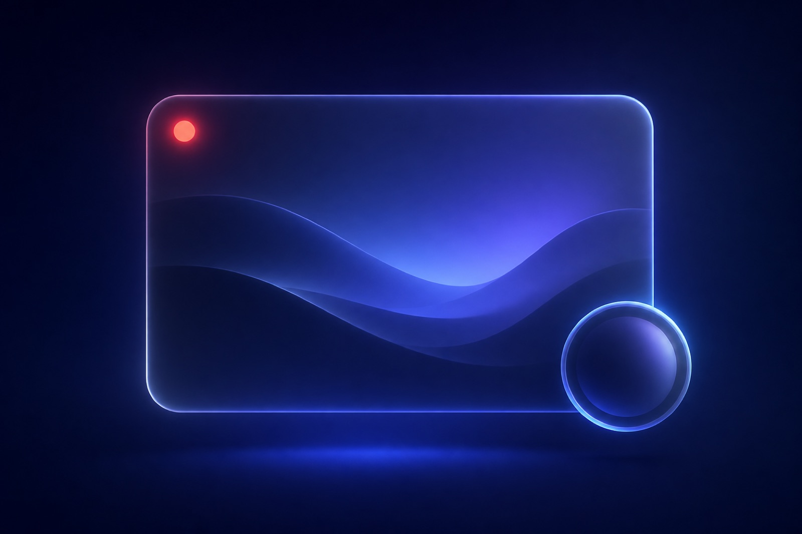
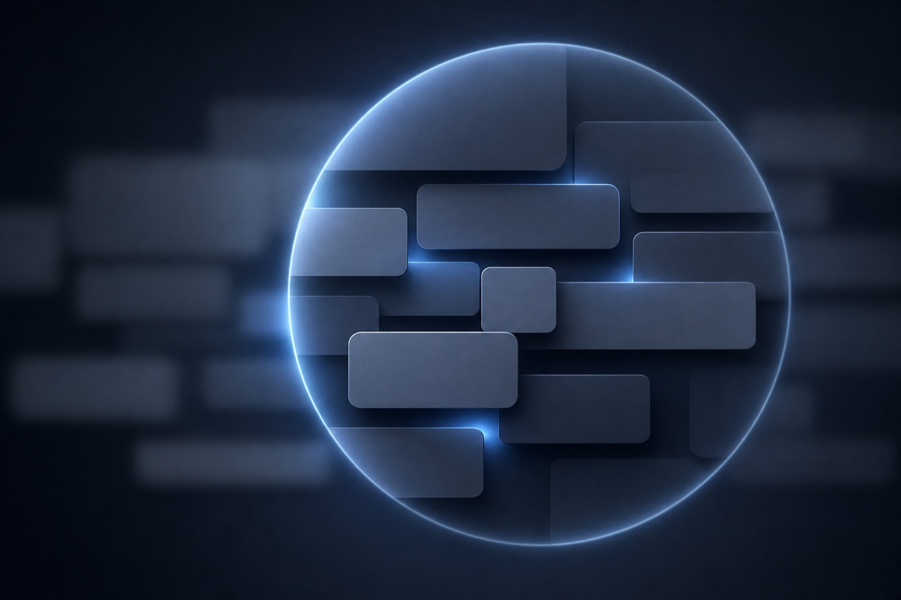

<p align="center">
  
</p>

<h1 align="center">简录 JianLu</h1>

<p align="center">
  一个所见即所得的 macOS 录屏与截图工具 · A WYSIWYG screen recorder and screenshot tool for macOS
</p>

<p align="center">
  
  
  
  
</p>

---

## 这是什么 · What it is

简录把「录屏 → 标注 → 缩放重点 → 剪辑 → 导出」串成一条流程，核心约束只有一条：**录制时看到的画面，就是导出成片里的画面**。

JianLu turns *record → annotate → zoom → trim → export* into one flow, built around a single rule:
**what you see while recording is exactly what the exported video shows.**

## 主要功能 · Features

| | 中文 | English |
|---|---|---|
| 🎥 | 区域/全屏录制，Retina 分辨率 | Region or full-screen capture at native Retina resolution |
| 🔍 | 单击鼠标中键放大光标区域，按键可配置 | Middle-click to magnify the cursor area; button is configurable |
| 👤 | 摄像头头像框：圆形/椭圆/方形/圆角，可拖动缩放 | Camera bubble: circle, oval, square or rounded — drag and resize |
| 🖼️ | 虚拟背景：内置场景 + 自定义图片 | Virtual backgrounds: built-in scenes plus your own image |
| ✨ | 美颜分三档：磨皮 / 美白 / 瘦脸 | Retouch split into smoothing, whitening and face slimming |
| ✏️ | 录制中实时标注：画笔、高亮、直线、箭头、方框、圆框 | Live annotation while recording |
| 📸 | 截图**按下即定格**，在静止画面上从容框选 | Screenshots freeze the screen on keypress, then you select at leisure |
| 🎨 | 截图编辑器：标注、文字、马赛克 | Screenshot editor with annotation, text and mosaic |
| ✂️ | 时间线分割/删除片段，导出前预览成片 | Split and delete clips, preview the composited result before exporting |
| 🌏 | 中英双语，即时切换 | Chinese and English, switchable instantly |
| 🚀 | 可选开机自启动 | Optional launch at login |

<p align="center">
  
</p>

## 所见即所得是怎么做到的 · How WYSIWYG is enforced

实时预览和导出成片是两套渲染实现（SwiftUI overlay vs. `AVVideoCompositing`），最容易分叉。项目用三条约束把它们钉死：

The live overlay and the export compositor are two independent renderers, which is exactly where drift creeps in. Three rules keep them in sync:

- **共享几何** — 头像框走 `NormalizedRect.cameraBubbleRect(in:shape:)`，缩放走 `ExportZoomTimeline.transform`，实时端由同一份变换推导。
- **共享样式** — 颜色、笔宽、箭头长度、圆角统一在 `AnnotationStyle`；导出按 `strokeScale` 把「点」换算成像素。
- **可执行的断言** — `JianLuBundleChecks` 用源码约定断言锁死图层顺序和布局写法，`JianLuCoreChecks` 端到端跑导出管线并逐像素校验。

## 快速开始 · Getting started

```bash
git clone <this repo>
cd 简录
./script/build_and_run.sh run     # 构建 .app 并启动 / build the .app and launch it
```

首次启动需要在「系统设置 › 隐私与安全性」授予**屏幕录制**（必需）、**摄像头/麦克风**（可选）、**辅助功能与输入监控**（快捷键需要）。macOS 授权后通常要重启 App 才生效。

On first launch, grant **Screen Recording** (required), **Camera / Microphone** (optional) and
**Accessibility / Input Monitoring** (for the shortcuts) in System Settings › Privacy & Security.
macOS usually applies these only after relaunching the app.

## 快捷键 · Shortcuts

| 操作 · Action | 默认 · Default |
|---|---|
| 区域截图 · Region screenshot | `⌃⌥⌘4`（或接管 `⇧⌘4`） |
| 录屏入口 / 停止 · Start / stop recording | `⌃⌥⌘R`（或接管 `⇧⌘5`） |
| 鼠标放大 · Mouse zoom | 单击鼠标中键 · Middle click |
| 按住缩放 · Hold to zoom | `⌃⌥⌘Z` |
| 缩放倍率 · Zoom level | `⌃⌥⌘ = / -` |
| 画笔/高亮/直线/箭头 · Pen / highlight / line / arrow | `⌃⌥⌘ P/H/L/A` |
| 方框/圆框 · Rectangle / ellipse | `⌃⌥⌘ B/O` |
| 撤销/清除 · Undo / clear | `⌃⌥⌘ U/X` |
| 摄像头开关/切换形状 · Toggle camera / shape | `⌃⌥⌘ C/S` |

「替代系统快捷键」模式会接管 `⇧⌘3/4/5` 并阻止 macOS 原生截图，需要辅助功能权限。

## 项目结构 · Project layout

```
Sources/
  JianLuCore/        # 与 UI 无关的模型、导出管线、几何与本地化
    Models/          #   RecordingProject, Timeline, ZoomLensGeometry …
    Export/          #   CameraShapeVideoCompositor, ExportZoomTimeline, CameraFrameProcessor …
    Support/         #   Localization
  JianLu/            # SwiftUI 应用
    App/             #   AppState — 所有意图的汇合点
    Services/        #   屏幕/摄像头/麦克风采集、热键、叠层窗口
    Views/           #   主界面、设置、录制叠层、截图编辑器
Tests/
  JianLuCoreChecks/  # 端到端：真的跑导出管线并逐像素断言
  JianLuBundleChecks/# 源码约定断言（图层顺序、布局写法、Info.plist）
script/build_and_run.sh
```

## 开发 · Development

```bash
swift build                     # 编译 / build
swift run JianLuCoreChecks      # 核心与导出管线检查 / core + export pipeline checks
swift run JianLuBundleChecks    # 约定与打包检查 / convention + bundle checks
./script/build_and_run.sh run   # 打包成 .app 并运行 / stage the .app and run
```

改动渲染相关代码时，**必须同时改实时端和导出端**，或收敛到已抽出的单一事实来源；两套检查会在约定被破坏时失败。

When touching anything that renders, change both the live and the export path — or route it
through the shared source of truth. The two check suites fail loudly when a convention breaks.

## 许可 · License

MIT
